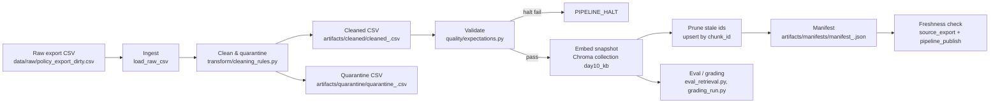

# Kiến trúc pipeline — Lab Day 10

**Nhóm:** Day10 Lab Team  
**Cập nhật:** 2026-06-10

---

## 1. Sơ đồ luồng (bắt buộc có 1 diagram: Mermaid / ASCII)



Điểm đo chính:

- `run_id`: ghi ngay khi pipeline bắt đầu và được gắn vào log, manifest, metadata Chroma.
- Freshness: đọc hai boundary trong manifest sau publish:
  - `source_export`: `latest_exported_at` từ dữ liệu nguồn, SLA 24 giờ.
  - `pipeline_publish`: `run_timestamp` của manifest, SLA 2 giờ để biết pipeline/index vừa được publish.
- Quarantine: mọi record bị loại khỏi cleaned được ghi kèm `reason`.

---

## 2. Ranh giới trách nhiệm

| Thành phần | Input | Output | Owner nhóm |
|------------|-------|--------|--------------|
| Ingest | `data/raw/policy_export_dirty.csv` | List raw rows, `raw_records` trong log | Ingestion / Raw Owner |
| Transform | Raw rows + allowlist/source rules | Cleaned rows + quarantine rows | Cleaning & Quality Owner |
| Quality | Cleaned rows | Expectation results, halt/warn decision | Cleaning & Quality Owner |
| Embed | Cleaned CSV | Chroma `day10_kb`, metadata `doc_id/effective_date/run_id` | Embed & Idempotency Owner |
| Monitor | Manifest JSON | Freshness `PASS/WARN/FAIL` + detail cho `source_export` và `pipeline_publish` | Monitoring / Docs Owner |

---

## 3. Idempotency & rerun

Pipeline publish theo snapshot. `chunk_id` được tạo ổn định từ `doc_id`, `chunk_text` sau clean và sequence. Khi embed, script:

1. Đọc tất cả id hiện có trong collection.
2. Xóa id không còn nằm trong cleaned run hiện tại (`embed_prune_removed`).
3. `upsert` theo `chunk_id`.

Vì vậy rerun cùng dữ liệu không làm phình vector store. Sprint 3 clean run ghi `embed_prune_removed=1`, chứng minh vector stale từ inject bad được loại trước khi publish bản sạch.

---

## 4. Liên hệ Day 09

Pipeline này dùng cùng domain CS + IT Helpdesk với Day 08/09 nhưng publish vào collection riêng `day10_kb`. Day 09 agent/retriever có thể trỏ sang collection này nếu muốn dùng corpus đã qua data quality gate. Việc tách collection giúp so sánh trước/sau mà không làm nhiễu artifact Day 09.

---

## 5. Rủi ro đã biết

- Dữ liệu mẫu có `latest_exported_at=2026-04-11T00:00:00`, nên freshness SLA 24h đang FAIL tại ngày chạy lab 2026-06-10.
- Với data mẫu, `source_export=FAIL` nhưng `pipeline_publish=PASS` nếu pipeline vừa chạy. Đây là tín hiệu đúng: index mới được publish từ snapshot cũ.
- Baseline eval dùng keyword/top-k, chưa có LLM judge để đánh giá câu trả lời cuối.
- Rule versioning HR hiện vẫn cấu hình bằng cutoff/phrase trong contract/code, chưa đọc động toàn bộ từ YAML.
- Report cá nhân cần tên thành viên thật để hoàn thiện `reports/individual/[ten].md`.

---

## 6. Kiểm chứng vận hành

Các lệnh kiểm chứng kỹ thuật:

```bash
.venv/bin/python etl_pipeline.py run --run-id sprint4-final
.venv/bin/python etl_pipeline.py freshness --manifest artifacts/manifests/manifest_sprint4-final.json
.venv/bin/python eval_retrieval.py --out artifacts/eval/sprint4_final_eval.csv
.venv/bin/python grading_run.py --out artifacts/eval/grading_run.jsonl
.venv/bin/python -m pytest -q
```

Kỳ vọng nộp bài: pipeline exit 0, grading đủ 10 câu pass, self-eval 21 câu không có failure. Freshness có thể overall `FAIL` do source snapshot cũ, nhưng detail phải cho thấy `pipeline_publish` không stale nếu vừa chạy.
